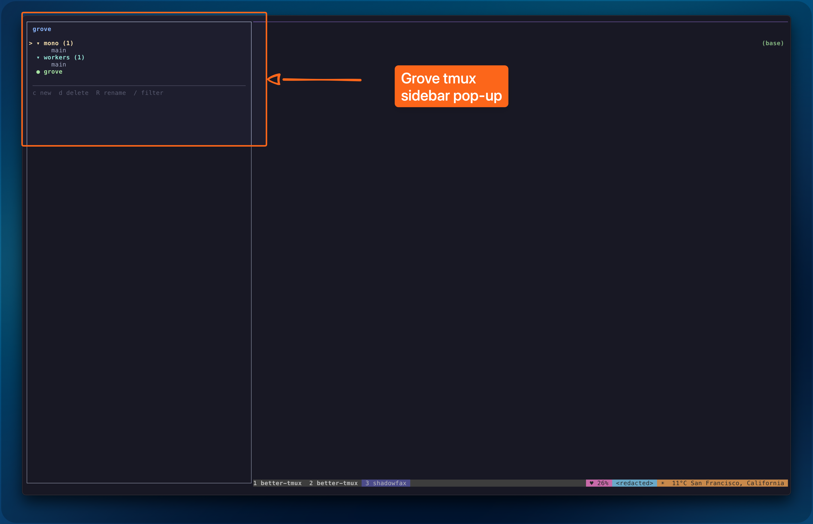

<div align="center">

# 🌳 Grove

**A tmux workspace manager built around git worktrees.**

*One sidebar. All your repos, branches, and sessions.*



</div>

You work across multiple repos, each with several worktrees for feature branches and agent tasks, plus standalone tmux sessions for scratch work. Navigating all of this is manual and chaotic. Grove gives you a single popup sidebar to see everything and switch instantly.

🔀 **One-key sidebar** (`Ctrl+S`) to see and switch between all workspaces
🌿 **Worktree lifecycle** — create and remove git worktrees with per-repo setup commands
🔄 **Session persistence** — if a tmux session dies, grove recreates it on next start
🎲 **Auto-generated names** — empty name → random animal (`mono/beluga`, `workers/pangolin`)
📁 **Plain workspaces** — standalone sessions for scratch, notes, anything
🔔 **Notifications** — any CLI in a grove session can send notifications to the sidebar

---

## Install

Requires Go 1.21+ and tmux 3.3+.

```sh
git clone <repo-url> grove
cd grove
make install    # builds and copies to ~/bin/
```

Make sure `~/bin` is on your `PATH`. Then disable terminal flow control so `Ctrl+S` passes through to tmux:

```sh
# add to .zshrc / .bashrc
stty -ixon
```

Optionally, add the sidebar keybinding to `~/.tmux.conf` so it survives config reloads without needing to re-run `grove start`:

```tmux
bind-key -n C-s display-popup -x 0 -y 0 -w "30%" -h "100%" -E "grove sidebar"
```

## Quick Start

```sh
# 1. Edit config to add your repos
grove config

# 2. Start grove — creates sessions, binds Ctrl+S, attaches to tmux
grove start
```

Once attached, press `Ctrl+S` to open the sidebar.

## Config

Location: `~/.config/grove/config.yaml` (created automatically on first run)

```yaml
prefix: "C-s"

sidebar:
  width: "30%"
  position: "left"    # left | right

repos:
  - path: ~/code/mono
    name: mono
    default_branch: main
    setup:
      - bun install
      - cp .env.example .env

  - path: ~/code/workers
    name: workers
    default_branch: main
    setup:
      - npm install
```

**`repos`** — git repositories to manage. Each gets its own group in the sidebar. On `grove start`, every repo automatically gets a workspace for its `default_branch` (defaults to `main`). `setup` commands run in new worktrees after creation.

## CLI

```sh
grove start                    # start grove, attach to tmux
grove new mono feat-auth       # create worktree + session in mono
grove new --plain notes        # create standalone session
grove rm mono/feat-auth        # kill session + remove worktree
grove list                     # show all workspaces and status
grove config                   # open config in $EDITOR
grove config --path            # print config file path
grove notify "build done"      # send notification to current session
grove notify --session grove/mono/main "deployed"
grove notify clear             # clear notification for current session
grove --version                # print version
```

## Sidebar Keybindings

| Key | Action |
|-----|--------|
| `j` / `k` | Move cursor down / up |
| `Enter` | Switch to workspace (clears notification) |
| `c` | Create new workspace |
| `d` | Delete workspace (with confirmation) |
| `R` | Rename workspace |
| `C` | Clear notification on workspace |
| `o` | Collapse/expand repo group (remembered across sessions) |
| `/` | Filter workspaces |
| `r` | Reload state and config |
| `q` / `Esc` / `Ctrl+S` | Close sidebar |

## How It Works

**Workspaces** are tmux sessions managed by grove. Two kinds:

- **Repo workspace** — tied to a git worktree. Created under `<repo>/.grove/worktrees/<name>/`. The tmux session starts in the worktree directory.
- **Plain workspace** — standalone session at any directory. Not tied to a repo.

**Session names** follow the pattern `grove/<repo>/<branch>` for repo workspaces and `grove/<name>` for plain workspaces.

**State** lives at `~/.local/state/grove/state.json`. This is the source of truth for what workspaces exist. It's locked with `flock()` to prevent corruption from concurrent commands.

**On startup**, grove reads config and state, creates default branch workspaces for all repos, creates any missing tmux sessions, binds the sidebar keybinding, and attaches. If a session was killed externally, grove recreates it — the worktree on disk is unaffected.

## Notifications

Any process running inside a grove tmux session can send a notification:

```sh
grove notify "build complete"
```

The sidebar shows a `★` badge next to workspaces with notifications. Hovering the cursor over a workspace shows the notification message in the footer. Switching to a workspace (`Enter`) or pressing `C` clears its notification.

One notification per workspace — new notifications overwrite the previous one.

## Worktree Layout

```
~/code/mono/                       # main checkout
~/code/mono/.grove/
  └── worktrees/
      ├── feat-auth/               # git worktree
      ├── bugfix-perf/             # git worktree
      └── beluga/                  # auto-named worktree
```

Grove adds `.grove/` to the repo's `.gitignore` automatically.
