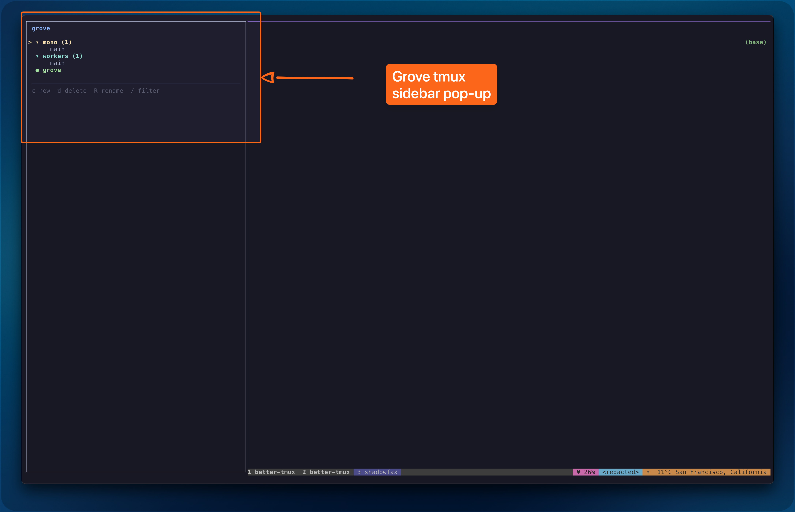

<div align="center">

# 🌳 Grove

**Tmux workspaces powered by git worktrees.**

*One sidebar. All your repos, branches, and sessions.*



</div>

You work across multiple repos, each with several worktrees for feature branches and agent tasks, plus standalone tmux sessions for scratch work. Navigating all of this is manual and chaotic. Grove gives you a single popup sidebar to see everything and switch instantly.

- 🔀 **One-key sidebar** (`Ctrl+S`) to see and switch between all workspaces
- 🌿 **Worktree lifecycle** — create and remove git worktrees with per-repo setup commands
- 🔄 **Session persistence** — if a tmux session dies, grove recreates it on next start
- 🎲 **Auto-generated names** — empty name → random animal (`mono/beluga`, `workers/pangolin`)
- 📁 **Plain workspaces** — standalone sessions for scratch, notes, anything
- 🖥️ **Session layouts** — integrates with [`layouts`](https://github.com/shadowfax92/layouts) CLI for tmux pane splits per repo
- 🔔 **Notifications** — any CLI in a grove session can send notifications to the sidebar

---

## Install

Requires Go 1.21+, tmux 3.3+, [fzf](https://github.com/junegunn/fzf), and optionally [`layouts`](https://github.com/shadowfax92/layouts) for session layouts.

```sh
git clone <repo-url> grove
cd grove
make install    # builds and copies to ~/bin/
```

Make sure `~/bin` is on your `PATH`. Then disable terminal flow control so `Ctrl+S` passes through to tmux:

```sh
# add to .zshrc / .bashrc
stty -ixon
```

**Fish shell helper** — install the `gv` wrapper function for shorter commands plus `gv nd`, `gv cd`, and `gv dd` path-changing helpers:

```sh
make fish       # copies gv.fish to ~/.config/fish/functions/
```

```fish
gv nd mono feat-auth       # create a new workspace and cd into it
gv n --cd mono feat-auth   # same flow, longer spelling
gv cd mono/feat-auth       # cd into an existing workspace
gv dd                      # finish the cwd-backed workspace and cd to the next one
```

Optionally, add the sidebar keybinding to `~/.tmux.conf` so it survives config reloads without needing to re-run `grove start`:

```tmux
bind-key -n C-s display-popup -x 0 -y 0 -w "30%" -h "100%" -E "grove sidebar"
```

## Quick Start

```sh
# 1. Edit config to add your repos
grove config

# 2. Start grove — binds Ctrl+S and attaches to tmux
grove start

# 3. Create workspaces
grove new mono feat-auth    # worktree in mono repo
grove new notes             # plain session (name doesn't match a repo)
```

Once attached, press `Ctrl+S` to open the sidebar.

## Config

Location: `~/.config/grove/config.yaml` (created automatically on first run)

```yaml
prefix: "C-s"

sidebar:
  width: "30%"
  position: "left"    # left | right

notify:
  forward:
    - mac-notify send "$MESSAGE" --source "$SESSION" --id "$SESSION"

repos:
  - path: ~/code/mono
    name: mono
    layout: dev
    setup:
      - bun install
      - cp .env.example .env

  - path: ~/code/workers
    name: workers
    setup:
      - npm install
```

**`notify.forward`** — shell commands to run when a notification is sent. `$SESSION` and `$MESSAGE` are substituted. Add any number of forwarding commands — failures are silently ignored.

**`repos`** — git repositories to manage. Each gets its own group in the sidebar. Set `layout` to reference a named layout from the [`layouts`](https://github.com/shadowfax92/layouts) CLI. `setup` commands run in new worktrees after creation. Repos only appear in the sidebar once they have at least one workspace.

## CLI

```sh
grove start                    # bind keys, reconcile sessions, attach to tmux
grove new                      # pick repo or type session name via fzf
grove new mono                 # pick or auto-generate branch in mono
grove new mono feat-auth       # worktree + session for specific branch
grove new notes                # plain session (name doesn't match a repo)
grove new --cd mono feat-auth  # create worktree, print path (no session)
grove cd                       # pick existing workspace and print its path
grove cd mono/feat-auth        # print the path for a specific workspace
grove done --tmux              # finish current tmux workspace and switch to the next one
grove done --cd                # finish workspace for current cwd and print the next path
grove done --cd mono/feat-auth # finish a specific workspace and print the next path
grove rm mono/feat-auth        # kill session + remove worktree
grove list                     # show all workspaces and status
grove switch                   # pick workspace via fzf and switch to it
grove config                   # open config in $EDITOR
grove config --path            # print config file path
grove notify "build done"      # send notification to current session
grove notify --session g/mono/main "deployed"
grove notify clear             # clear notification for current session
grove --version                # print version
```

Most commands have short aliases: `new`→`n`, `done`→`d`, `list`→`ls`/`l`, `switch`→`s`/`sw`, `rm`→`remove`, `config`→`cfg`.

## Sidebar Keybindings

| Key | Action |
|-----|--------|
| `j` / `k` | Move cursor down / up |
| `Enter` | Switch to workspace (clears notification) |
| `c` | Create new workspace |
| `d` | Delete workspace (with confirmation) |
| `R` | Rename workspace |
| `C` | Clear notification on workspace |
| `o` | Collapse/expand repo group (remembered across sessions) |
| `/` | Filter workspaces |
| `r` | Reload state and config |
| `q` / `Esc` / `Ctrl+S` | Close sidebar |

## How It Works

**Workspaces** are tmux sessions managed by grove. Two kinds:

- **Repo workspace** — tied to a git worktree. Created under `<repo>/.grove/worktrees/<name>/`. The tmux session starts in the worktree directory.
- **Plain workspace** — standalone session at any directory. Not tied to a repo.

**Session names** follow the pattern `g/<repo>/<branch>` for repo workspaces and `g/<name>` for plain workspaces.

**State** lives at `~/.local/state/grove/state.json`. This is the source of truth for what workspaces exist. It's locked with `flock()` to prevent corruption from concurrent commands.

**On startup**, grove reads config and state, recreates any missing tmux sessions for existing workspaces, binds the sidebar keybinding, and attaches. If a session was killed externally, grove recreates it — the worktree on disk is unaffected.

## Notifications

Any process running inside a grove tmux session can send a notification:

```sh
grove notify "build complete"
```

The sidebar shows a `★` badge next to workspaces with notifications. Hovering the cursor over a workspace shows the notification message in the footer. Switching to a workspace (`Enter`) or pressing `C` clears its notification.

One notification per workspace — new notifications overwrite the previous one.

## Worktree Layout

```
~/code/mono/                       # main checkout
~/code/mono/.grove/
  └── worktrees/
      ├── feat-auth/               # git worktree
      ├── bugfix-perf/             # git worktree
      └── beluga/                  # auto-named worktree
```

Grove adds `.grove/` to the repo's `.gitignore` automatically.

---

> This is a personal tool I built for my own workflow. I'm sharing it in case it's useful to others, but I'm not actively seeking feature requests or contributions. Feel free to fork and adapt it to your needs.
