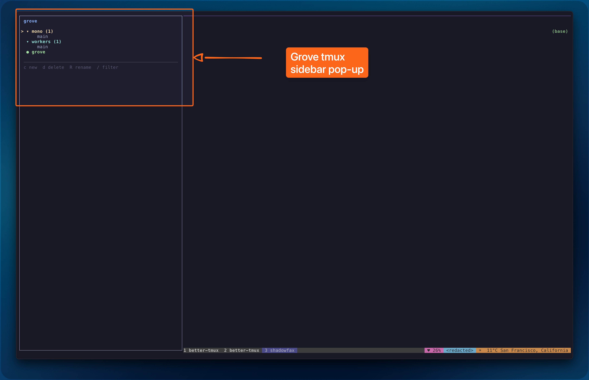

<div align="center">


# grove

**Tmux workspaces powered by git worktrees.**

*Pick a workspace, jump in — one command from anywhere.*

</div>

Grove is path-first: every command prints a workspace path, and the `gv` fish helper turns that path into a `cd`. Workspaces are git worktrees named like tmux sessions (`g/<repo>/<branch>`), so every branch becomes a place you can stand.

- **Picker-first** — bare `grove` fuzzy-finds a workspace and prints its path; `gv` drops you in
- **A worktree per branch** — `grove new` adds a git worktree, so branches are directories instead of stashes
- **tmux-ready** — workspaces are named like tmux sessions (`g/<repo>/<branch>`), ready for your session picker
- **Shared roots** — every worktree lives under one `~/worktrees` tree, overridable per repo
- **Prepare & setup hooks** — pull main, install deps, run anything before and after a worktree is born
- **Fish helper** — `gv`, `gv n`, `gv cd`, `gv dd` wrap the path-printing core into real `cd`s
- **Plain & dir workspaces** — not everything needs a worktree; back one with any directory or just `$HOME`
- **Self-cleaning** — `grove done` retires one workspace, `grove reap` safely retires stale merged workspaces, `grove cleanup` sweeps orphaned worktrees

---

## Install

Requires Go 1.24+, git, and [fzf](https://github.com/junegunn/fzf). Built for life inside tmux.

```sh
git clone https://github.com/shadowfax92/grove
cd grove
make install
```

`make install` builds `grove`, installs it to `~/bin/grove`, codesigns it on macOS, and installs the fish `gv` helper to `~/.config/fish/functions/gv.fish`.

## Quick Start

```sh
grove init                        # register the current repo in config
grove new mono feat/build-auth    # create a worktree, print its path
grove new --here chore/readme --json  # create and print metadata JSON
grove cd mono/feat/build-auth     # find an existing workspace, print its path
grove list --json                  # print state-backed workspace JSON
grove reap --dry-run                # preview stale merged workspaces safe to retire
grove rm --path ~/worktrees/mono/feat-build-auth --yes
grove done mono/feat/build-auth   # finish it and remove the worktree
```

Use `gv` instead of `grove` whenever you want the shell to `cd` into the path it prints.

## Paths

Grove lays worktrees out under a shared root so a repo's branches sit together:

```text
<worktree_root>/<repo>/<branch-dashed>/
```

`grove new mono feat/build-auth` creates `~/worktrees/mono/feat-build-auth/` — the branch's `/` becomes `-`, while the session name keeps it: `g/mono/feat/build-auth`.

## The `gv` helper

`gv` is a fish function that runs a grove command, reads the path it prints, and `cd`s you there — the one thing `grove` can't do from a subprocess.

```fish
gv                          # pick a workspace and cd into it
gv n mono feat/build-auth   # new worktree, then cd in
gv n --here fix/local-bug   # worktree the current repo, then cd in
gv cd mono/feat/build-auth  # cd into an existing workspace
gv dd                       # finish the current workspace and cd home
gv ls                       # list workspaces
```

Any other subcommand falls straight through to `grove` (`gv rm`, `gv config`, …).

## Commands

### Navigate

```sh
grove                              # pick a workspace and print its path
grove cd [workspace]               # pick or name a workspace, print its path
grove list                         # show workspaces as a session tree (ls, l)
grove list --json                  # print state-backed workspaces as JSON
grove which                        # print the registered repo name for the cwd
grove which ~/code/mono/pkg        # ...or for a given path
```

### Create

```sh
grove init                         # add the current git repo to config
grove init --name mono --default-branch dev
grove new                          # pick a repo, or type a plain workspace name
grove new mono                     # auto-name a branch in mono
grove new -m                       # prompt for the branch name
grove new mono feat/build-auth     # create or check out a specific branch
grove new mono agent --from feat/base   # branch agent off feat/base
grove new --here fix/local-bug     # worktree the current git repo
grove new --no-prepare mono agent  # skip prepare commands
grove new --json mono agent        # print worktree_path, branch, repo, repo_path, created_at
```

### Remove

```sh
grove done [workspace]             # finish a workspace, print $HOME (d)
grove rm [workspace...]            # remove workspaces and their worktrees (remove)
grove rm --path <worktree> --yes   # remove one worktree-backed workspace without prompts
grove rm -j 2                      # cap parallel worktree deletion
grove reap --dry-run                # report stale managed workspaces selected/skipped
grove reap --ttl 12h                # override the configured idle threshold
grove cleanup                      # remove orphaned worktrees under grove roots
grove cleanup --all -f             # remove every orphan, no prompts
```

### Configure

```sh
grove config                       # open config in $EDITOR (cfg)
grove config --path                # print the config path
```

`grove which` exits non-zero for unregistered paths, so it doubles as a guard in scripts.

## Config

Location: `~/.config/grove/config.yaml`. A fresh config starts with a global worktree root:

```yaml
worktree_root: ~/worktrees

reap:
  ttl: 6h

repos:
  - path: ~/code/mono
    name: mono
    default_branch: main
    prepare:
      - git diff --quiet && git diff --cached --quiet || (echo "uncommitted changes" && exit 1)
      - git checkout main
      - git pull
    setup:
      - bun install

  - path: ~/code/special
    name: special
    default_branch: main
    worktree_root: ~/scratch/special-worktrees   # per-repo override

  - path: ~/notes
    name: notes
    type: dir
```

### Repo fields

| Field | Description |
|-------|-------------|
| `path` | Base repo path |
| `name` | Config name used by commands and session names |
| `type` | `worktree` (default), `dir` for a directory-backed workspace, or `plain` for a home-rooted one |
| `default_branch` | Branch checked out by the default prepare commands |
| `worktree_root` | Per-repo override for where this repo's worktrees land |
| `workdir` | Subdirectory to print and enter after the worktree is created |
| `prepare` | Commands run in the base repo before a workspace is created |
| `setup` | Commands run in the new workspace after the worktree exists |

### Reap

`grove reap` removes only Grove-managed worktree workspaces that are stale and independently proven safe:

- idle longer than `reap.ttl` (default `6h`, override with `grove reap --ttl 1h`)
- no live tmux session for the stored Grove session name
- current branch still matches Grove state
- clean git status, including no untracked files
- worktree HEAD is already reachable from `origin/<default_branch>` or the local default branch

Anything recent, dirty, unmerged, active, non-worktree, missing, malformed, or otherwise ambiguous is preserved and reported. Use `grove reap --dry-run` for a full selected/skipped report before deletion. Reaping uses the same bounded removal and state-restore path as `grove rm`, so state is restored for any worktree that fails to remove.

### Worktree roots

Where a worktree lands depends on which `worktree_root` is set:

| Setting | Layout |
|---------|--------|
| Top-level `worktree_root` | `<worktree_root>/<repo>/<branch-dashed>/` |
| Repo-level `worktree_root` | `<repo worktree_root>/<branch-dashed>/` — no repo name added |
| Neither | `<repo>/.grove/worktrees/<branch>/` — legacy layout |

`grove init` appends a worktree entry for the current git root: it infers the name from the directory, the default branch from `origin/HEAD` → `main` → `master` → the current branch, and leaves `setup: []` for you to fill in.

## Machine-readable automation

`grove new --json` keeps creation behavior unchanged but writes this JSON object to stdout instead of the bare path:

```json
{
  "worktree_path": "/Users/me/worktrees/mono/feat-json",
  "branch": "feat/json",
  "repo": "mono",
  "repo_path": "/Users/me/code/mono",
  "created_at": "2026-07-01T18:06:00Z"
}
```

`grove list --json` writes a JSON array from Grove state. Each object contains `name`, `repo`, `repo_path`, `branch`, `worktree_path`, `session_name`, `created_at`, and `last_used_at`.

`grove rm --path <worktree_path> --yes` is non-interactive: it never opens fzf and never prompts. It exits with:

- `0`: removed, or state existed and the worktree was already gone.
- `3`: no Grove state entry matched the path.
- `4`: Grove found the state entry but failed to remove the worktree; the state entry is restored.

`grove reap --dry-run` is also non-interactive and reports both selected and skipped managed workspaces with reasons. A non-dry run removes only the selected safe workspaces; partial failures leave the failed workspaces in state and return exit code `4`.

## Workspaces

Grove tracks three kinds of workspace:

- **Worktree** — a git worktree per branch, the default. The directory uses the dashed branch (`feat/build-auth` → `feat-build-auth`); the session name keeps the slashes (`g/mono/feat/build-auth`).
- **Dir** — reuses a configured directory instead of creating a worktree, for notes or non-git folders.
- **Plain** — a standalone workspace rooted at `$HOME`, named `g/<name>`.

<div align="center">

</div>

`grove cleanup` finds git worktrees that exist on disk under grove-owned roots but are no longer in grove's state, and offers to remove them — it understands the global root, per-repo overrides, and the legacy `.grove/worktrees` layout. It is intentionally separate from `grove reap`, which only considers managed state entries and refuses to remove anything it cannot prove is stale, clean, inactive, and merged.

---

> Personal tool built for my own workflow. Feel free to fork and adapt.
